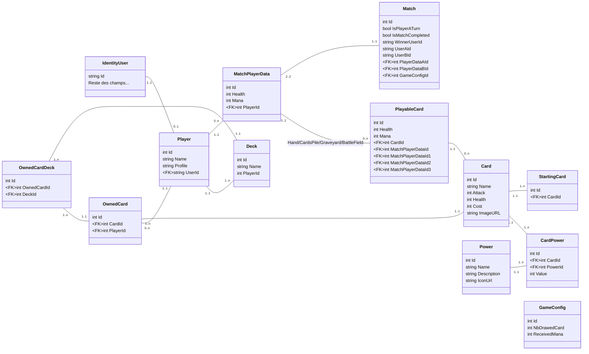

# Super Cartes Infinies

## Diagramme

```mermaid
classDiagram
    direction RL
    Player "0..1" -- "1..1" IdentityUser
    MatchPlayerData "0..n" -- "1..1" Player
    Match "1..1" -- "2..2" MatchPlayerData
    PlayableCard "0..n" -- "1..1" MatchPlayerData : Hand/CardsPile/Graveyard/BattleField
    Card "0..n"  -- "1..1" PlayableCard
    Card "1..1"  -- "1..n" OwnedCard
    Player "1..1"  -- "0..n" OwnedCard
    StartingCard "1..n"  -- "1..1" Card
    CardPower "1..n" -- "1..1" Power
    CardPower "1..n" -- "1..1" Card
    Deck "1..1" -- "1..n" OwnedCardDeck
    Deck "1..n" -- "1..1" Player
    OwnedCard "1..1" -- "1..n" OwnedCardDeck
    class IdentityUser{
      string Id
      Reste des champs...
    }

    class Player{
      int Id
      string Name
      string Profile
      &lt;FK&gt;string UserId
    }

    class Deck{
      int Id
      string Name
      int PlayerId
    }

    class OwnedCardDeck{
      int Id
      &lt;FK&gt;int OwnedCardId
      &lt;FK&gt;int DeckId
    }


    class Power{
      int Id
      string Name
      string Description
      string IconUrl
    }

    class CardPower{
      int Id
      &lt;FK&gt;int CardId
      &lt;FK&gt;int PowerId
      int Value
    }

    class Match{
      int Id
      bool IsPlayerATurn
      bool IsMatchCompleted
      string WinnerUserId
      string UserAId
      string UserBId
      &lt;FK&gt;int PlayerDataAId
      &lt;FK&gt;int PlayerDataBId
      &lt;FK&gt;int GameConfigId
    }

    class MatchPlayerData{
      int Id
      int Health
      int Mana
      &lt;FK&gt;int PlayerId
    }

    class PlayableCard{
      int Id
      int Health
      int Mana
      &lt;FK&gt;int CardId
      &lt;FK&gt;int MatchPlayerDataId
      &lt;FK&gt;int MatchPlayerDataId1
      &lt;FK&gt;int MatchPlayerDataId2
      &lt;FK&gt;int MatchPlayerDataId3
    }

    class Card{
      int Id
      string Name
      int Attack
      int Health
      int Cost
      string ImageURL
    }

    class GameConfig{
      int Id
      int NbDrawedCard
      int ReceivedMana
    }

    class OwnedCard{
      int Id
      &lt;FK&gt;int CardId
      &lt;FK&gt;int PlayerId
    }

    class StartingCard{
      int Id
            &lt;FK&gt;int CardId
    }


```
